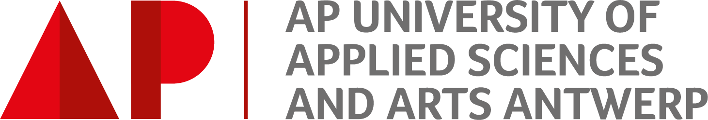

# EPS Project: Hello Hyperreality (2023)

## Introduction

This project is part of the [European Project Semester](https://www.ap.be/en/programme/european-project-semester-eps), or EPS, at [AP University of Applied Sciences and Arts Antwerp](https://www.ap.be/en/homepage), commissioned by, and in cooperation with, the [Immersive Lab](https://www.ap.be/en/researchgroup/immersive-lab).

The European Project Semester is an international program with the focus on inter-cultural and inter-disciplinary project work, which is reflected by the team composition.

The subject of  this project is **environmental immersion in a virtual reality nature experience**.
The aim is to research different ways to heighten the immersion of users in virtual reality experiences, specifically in *nature* environments, like for example a forest.
The research is done by conducting four user tests. The first used a demo for the HTC Vive called The Lab. For the other three self-build virtual environments were created with a matching physical real-world installation using the Meta Quest 2 as headset. The Unity project for these environment can be found in this repository.

Team members Hello Hyperreality (HYPER):

- Bavo Debraekeleer (Belgium, Electronics-ICT) - Lead Developer and Assistant Producer
- Gabriel Copier (France, Engineering) - Engineer Physical Installation
- Leire Lisón Nicuesa (Spain, Global Digital Humanities) - Researcher and Team Coordinator
- Philipp Parteder (Austria, Media Technology) -  Multimedia Producer and Assistant Developer
- Victor Fernández Moya (Spain, Industrial Design and Product Development Engineering) - Engineer Physical Installation

Clients and sponsors from the Immersive Lab research group at AP University:

- Jeroen Cluckers (Creative Lead)
- Lowie Spriet (Lab Manager and Tech Lead)
- Florian Stigter Van Thillo (Intern Student)

Coaches from AP University:

- Project coaches: Erwin Listhaeghe & Hiram Bollaert
- Agile Project Management coach: Flor Holvoet
- EPS coordinators: Geert Marrin & Bie Dirkx

